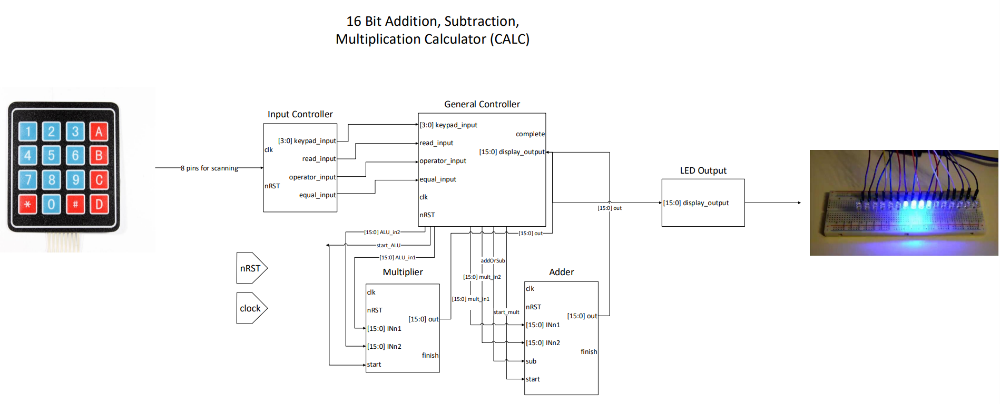
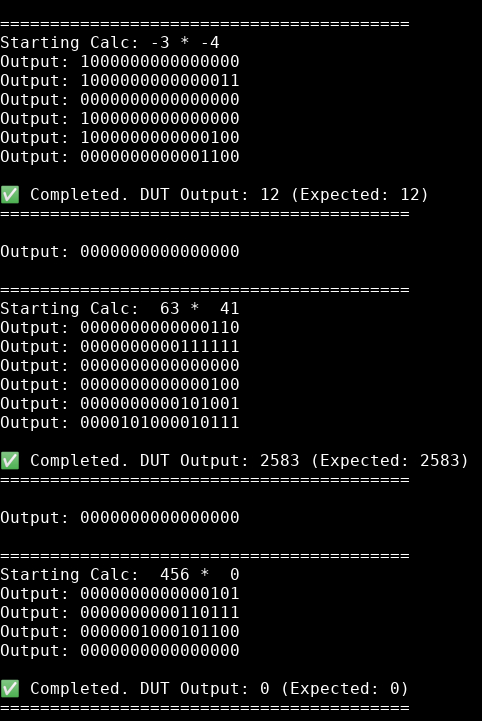
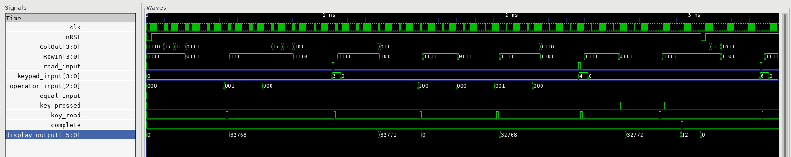
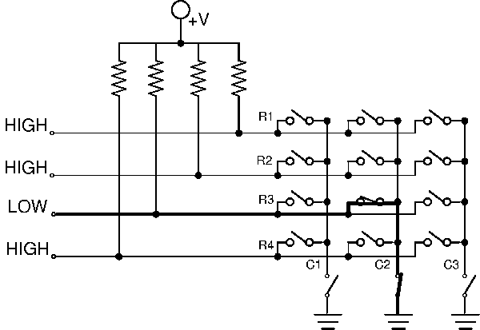
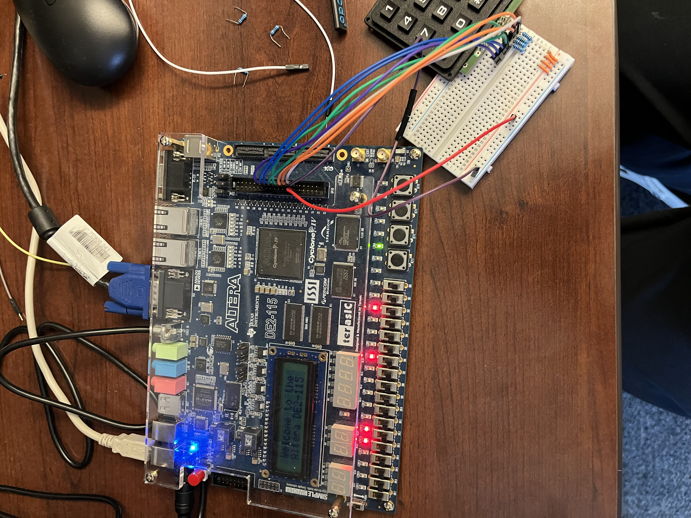
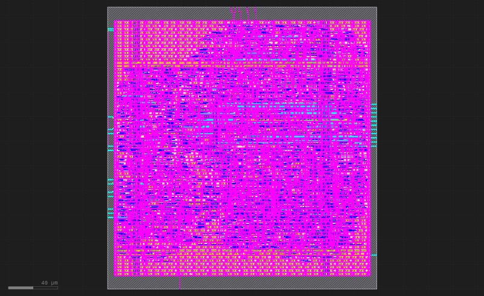

# The Computational Arithmetic Logic CALC (CALC)

This is a 15-bit signed calculator implemented in SystemVerilog during the Spring 2025 semester for Intro to SoCET 2. It features our very own adder modules, up to 16 bit signed addition and multiplication. Our project includes synthesizable source code, testbenches for simulation, and the GDS file to be sent to Tiny Tapeout.

## Features
1. 15-bit signed integer capability
2. Supports addition, subtraction, and multiplication, all hand written from scratch
3. Keypad-capable input
4. 15 bit LED binary output

## Deployments
1. FPGA tested on Altera Cyclone IV board
2. Built and generated GDSii file using OpenLane 2

## RTL Diagram

|  | 
|:--:| 
| *Full RTL Block Diagram* |

## Module Overview
This project has three main module groups, with the input and general controllers being instantiated in the top module and the ALU in the general controller.

**Input Controller** - Scans keypad, debounces and decodes keypad press, then sends digit, operator, and equals sign to the general controller to interact with the ALU

**General Controller** - Main FSM, works with keypad input and builds operands and expression to be computed in ALU, then finally displays output using 16 LEDs

**ALU (Addition/ Multiplication/ Signed Operations)** - Computes expressions given by general controller with magnitude based signing

## Simulation & Verification
This project was extensively verified using testbenches and GTKWave for waveform visualization.

### Simulation: Testbench Details
- located in `/testbench`
- tests cover:
    - Digit-by-digit keypad entry (including negative and multiple digits)
    - Operator key handling (add, sub, mult)
    - FSM transitions (operand collection, computation, result displaying)
    - Edge cases (e.g. 0, overflow, negative x negative)
 
Example test cases:

For `calculator_top` in `/testbench/calculator_top_tb.sv`
```
    run_calc_sequence(1, 3, KEY_MULT, 1, 4, 12); // -3 * -4 = 12
    run_calc_sequence(0, 63, KEY_MULT, 0, 41, 2583); // 63 * 41 = 2583
    run_calc_sequence(0, 456, KEY_MULT, 0, 0, 0); // 456 * 0 = 0
```

Output:
|  | 
|:--:| 
| *Successful test cases* |

### Simulation: Waveforms

Waveforms were viewed using GTKWave. These waveforms were instrumental in debugging our calculator. We probably spent more than half our time with one of these open dragging our mouse over the waves and finding out all the things we did wrong with our design. Lifesaver!

|  | 
|:--:| 
| *Calculator Top Module Waveforms in GTKWave* |

## FPGA Deployment (Altera)
After we functionally verified our design and integrated the modules together, we had to flash the design onto an FPGA to make sure it works physically. A big challenge was getting our keypad to work, which we did after messing around with resistors and multimeters to get our keypad to work while being pulled high.

|  | 
|:--:| 
| *Keypad circuit schematic (Courtesy of Jameco Electronics)* |

Our `wrapper.sv` file can be seen in `/source/wrapper.sv`, where we declared GPIO pins for reading and driving the keypad pins from the Cyclone IV and also LEDs for the output. We had the green LEDs act as views into the internal state of our design and the red LEDs for the output.

|  | 
|:--:| 
| *Design flashed onto the FPGA* |

 An additional debounce was added after flashing for waiting for the button to be released, as well as changing some flags in the input controller to be only asserted for one clock cycle to avoid unwanted behaviors in the general controller. 

## OpenLane 2 Deployment for Tape out

Hardening the chip was done thanks to the [socet_openlane_flow](https://github.com/Purdue-SoCET/socet_openlane_flow) repository. An error had to be fixed with declaring functions returning constant values, but after that the design was able to be checked for design rule errors and successfully passed.

|  | 
|:--:| 
| *Physical Layout in KLayout* |

## Authors
1. Nicholas Zhang
2. Lucas Mallen
3. Amogh Havanagi
4. Matthew Du
5. Jeet Jagad

## Conclusion

A big thanks needs to be given to Miguel and Malcolm for guiding us through this project and helping us during those long crucial hours at the end of the semester. We learned so much from this project and are extremely thankful for the opportunities our TAs and SoCET have given us to excel in such an amazing environment.
